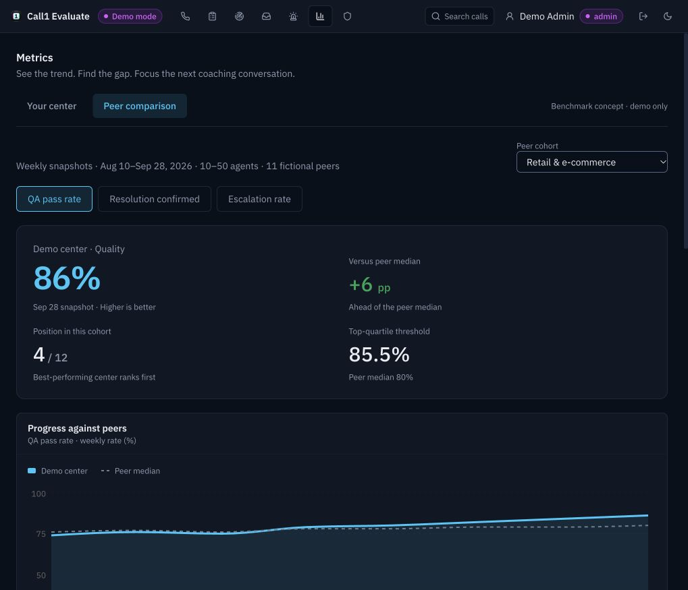
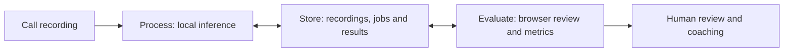

# Call1

[](https://github.com/intreaction/call1-qa/actions/workflows/ci.yml)

**Turn call recordings into evidence your team can review.**

Call1 is a local call-quality analysis project with searchable transcripts, configurable QA rubrics, contact signals, and human review. Try the browser demo with scripted results, or run local models on an Apple Silicon Mac to process recordings.

## What you can do

- **Follow a recording through processing.** Inspect transcription, speaker attribution, personal-information masking, tone, sentiment, scoring, and summary jobs.
- **Review the evidence.** Play audio, jump from a quoted finding to its transcript turn, and search conversations by meaning.
- **Define quality for your team.** Configure weighted criteria and policy context, test an unpublished rubric, and record explained reviewer overrides.
- **Find coaching opportunities.** Review caller needs, issues, outcomes, alerts, and aggregate quality trends.
- **Explore peer comparisons.** Fictional center benchmarks illustrate the concept; live cross-organization comparisons are not connected.



*Illustrative benchmark data, separate from your center's actual results.*

## Try the demo

You need **Python 3.12** and **FFmpeg** on your PATH. Node.js is only needed for frontend development; built web assets are included. Model weights and API keys are not required for the scripted demo.

```sh
git clone https://github.com/intreaction/call1-qa.git
cd call1-qa
python3 -m venv .venv
source .venv/bin/activate
python -m pip install -r requirements.txt
python -m call1.launch --demo --handlers fake
```

The launcher opens three browser pages:

| App | Default address | Purpose |
| --- | --- | --- |
| Evaluate | http://localhost:8010/ | Call library, review, rubrics, signals, and metrics |
| Process | http://127.0.0.1:8020/ | Import recordings and inspect processing |
| Store console | http://localhost:8010/console/ | Service health and operational state |

Choose **Continue as Demo Admin** in Evaluate. Explore the 560 fictional historical sessions, then open **Process → Import → Process demo call** to follow a new recording through the pipeline. With `--handlers fake`, analysis is scripted; it demonstrates the workflow and does not measure model accuracy.

Use the **Process link printed by the launcher**, including its console credential. A bare Process URL opens without write access. Keep that credential link private. Press **Ctrl-C** in the terminal to stop the services. Use `--no-open` to open the pages yourself.

Demo data stays in `data/demo/`. Demo sign-in is intended for localhost and fictional data; regular installations use the account/passkey flow.

## Process real recordings

Real inference runs with separately installed models. On Apple Silicon, install `requirements-mlx.txt`, provision the weights, and follow [Operations](docs/Operations.md) for configuration and model paths.

```sh
CALL1_BACKEND=mlx python -m call1.launch --demo --handlers real
```

The included AppTek recording is an attributed 15.5-second role-play excerpt. It demonstrates processing, search, and review, but a mid-call excerpt cannot establish whether an opening disclosure or closing occurred. Use complete recordings you are authorized to process when assessing a full-call rubric.

Model output requires judgment. Masking can miss personal information, speech and speaker labels can be wrong, and QA findings need context. Call1 preserves the machine score and records reviewer overrides separately; it is not a compliance certification.

## How it fits together



Process performs inference; Store owns persistent records and job state; Evaluate provides the review workspace. The current distribution runs as local services with a browser UI. Hosted subscriptions and shared industry benchmarks remain proposed features.

Model weights, uploaded recordings, runtime data, and credentials are excluded from Git. Third-party model and dataset licenses still apply to separate downloads.

## Develop and test

With the virtual environment activated:

```sh
python -m pip install -r requirements-dev.txt
python scripts/generate_test_audio.py
python -m pytest tests -q

cd frontend
npm ci
npm run typecheck
npm run typecheck:e2e
npm run build
```

The audio generator creates deterministic **non-speech test fixtures** for scripted handlers. It refuses to overwrite existing audio; these fixtures must not be used to qualify real models.

[CI](https://github.com/intreaction/call1-qa/actions/workflows/ci.yml) keeps routine pushes fast: TypeScript checks, builds for all three apps, and a runtime dependency audit. For the full Python suite and light/dark browser smoke tests, choose **Run workflow → full_validation** in GitHub Actions. Tests stay in the repository and use scripted handlers without model weights. See [Development](docs/Development.md) for local test commands.

| Guide | Covers |
| --- | --- |
| [Architecture](docs/Architecture.md) | Component boundaries and data flow |
| [Operations](docs/Operations.md) | Demo startup, real inference, credentials, and data |
| [Development](docs/Development.md) | Builds, tests, and API contracts |
| [License status](docs/LicenseStatus.md) | Source licensing and third-party components |

## Team and licensing

Built for the CIS 568 team project by **John Wheeler, Ryan Wolff, and Cameron Anthony**. John led technical implementation and system design; Ryan covered market and competitive analysis; Cameron covered business and financial analysis.

Core licensing remains pending: public visibility does not grant an open-source license. See [third-party notices](THIRD_PARTY_NOTICES.md) for separately licensed code, fonts, model components, and AppTek materials.
