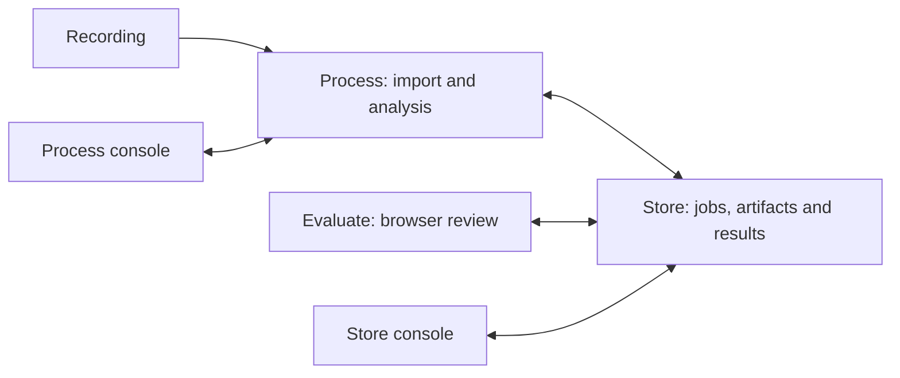

# Architecture

Store is the sole owner of durable call data, processing jobs and reviewer state. Process uses the versioned Store HTTP API. Evaluate uses Store's API; it does not open a database or talk directly to Process.

Process runs a dependency graph: audio validation, speech-to-text and optional vocabulary pass, speaker attribution, transcript masking, then text sentiment, acoustic tone, semantic search embeddings, rubric scoring, summaries and contact signals. Audio and masked-text branches use different inputs. Each job has its own state, provenance and retry handling.

The UI exposes partial progress and evidence for human review. Model output is an aid to QA; the application does not establish independently validated scoring accuracy. Demo benchmarks are fictional examples.

## Code map

- `call1/store/`: API, database, queue, accounts, results and audit history.
- `call1/process/`: worker, ingestion, model catalog, local console and training controls.
- `call1/contracts/`: API schemas and generated OpenAPI contract.
- `call1/pipeline/`, `call1/adapters/`, `call1/models/`: shared inference and schemas used by Process.
- `frontend/src/apps/`: Evaluate, Store console and Process console.
- `frontend/public/`: shared fonts and icons, with their notices.
- `call1/launch.py`: starts Store and Process as independent subprocesses.

Some shared implementation predates the three-app split. It remains because the current pipeline uses it. The previous combined server, database layer, native shell and packaging toolchain are absent.

Detailed API and subsystem notes remain beside the code in the Store, Process and contracts READMEs.

The retail rules demo also includes a separately attributed CC-BY-SA example bank under `call1/process/resources/signal-banks/`. Operator-installed banks take precedence; no private runtime data is packaged.
